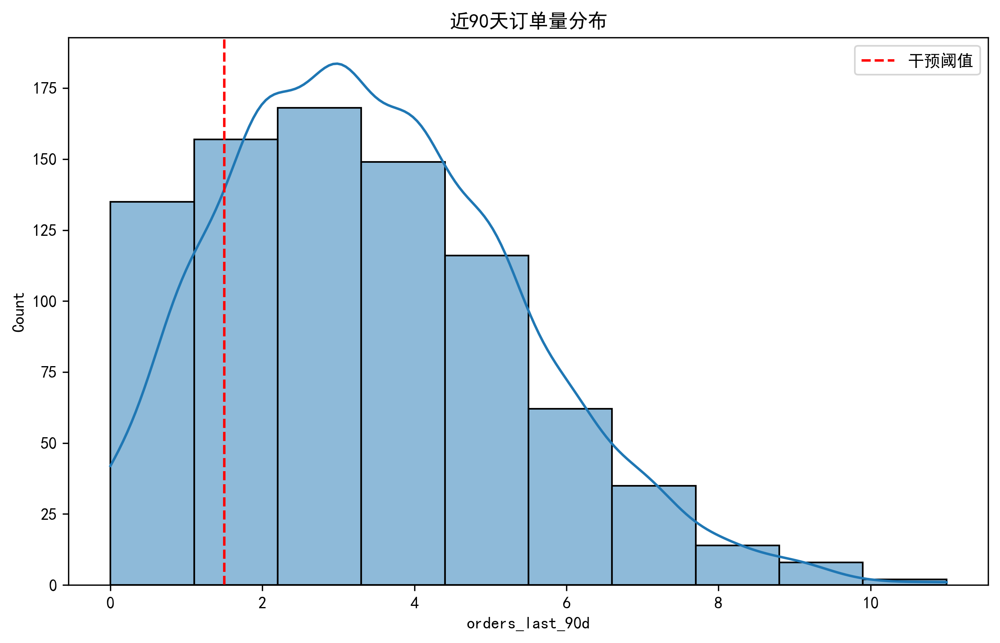
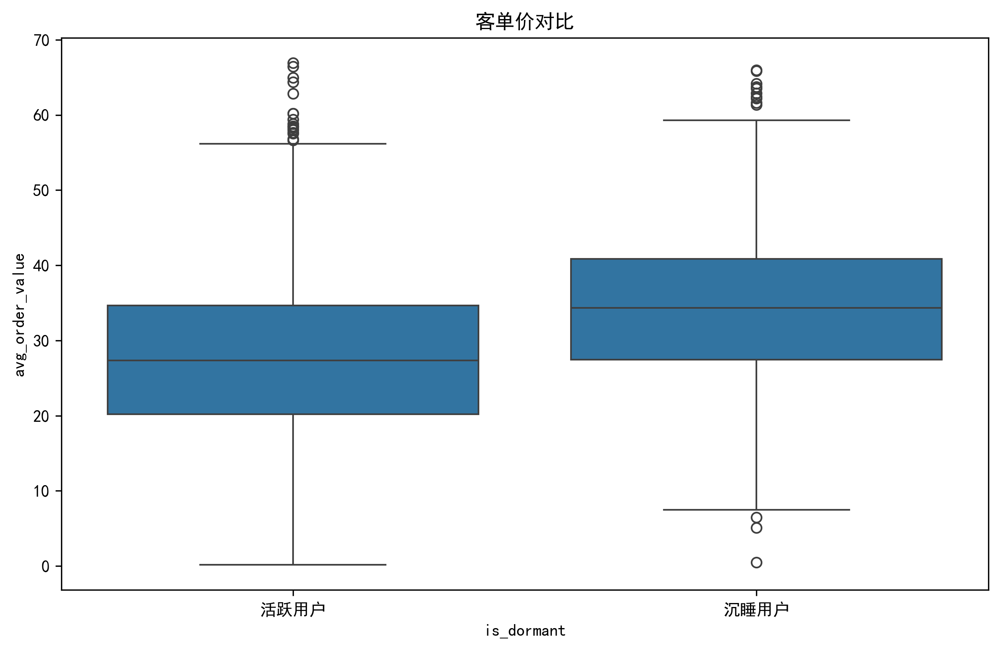
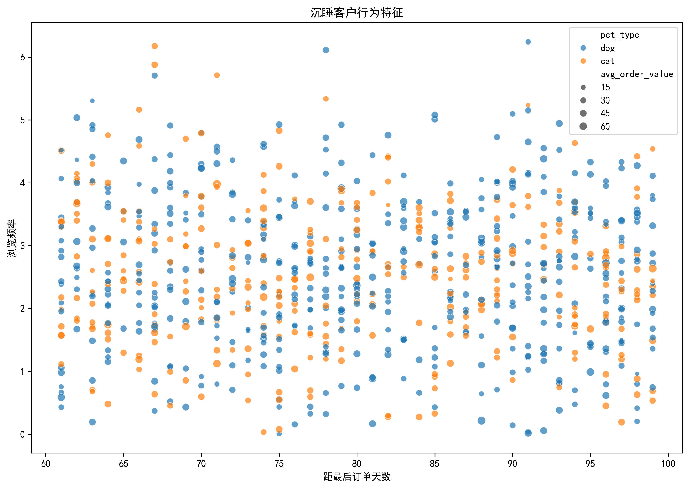
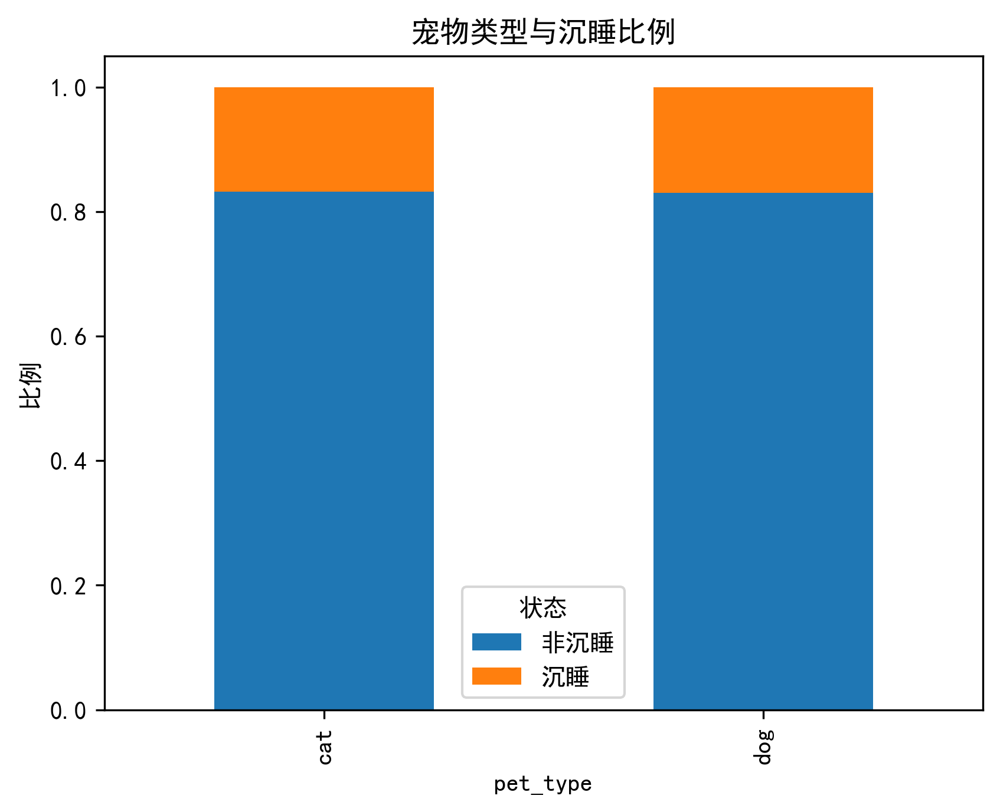
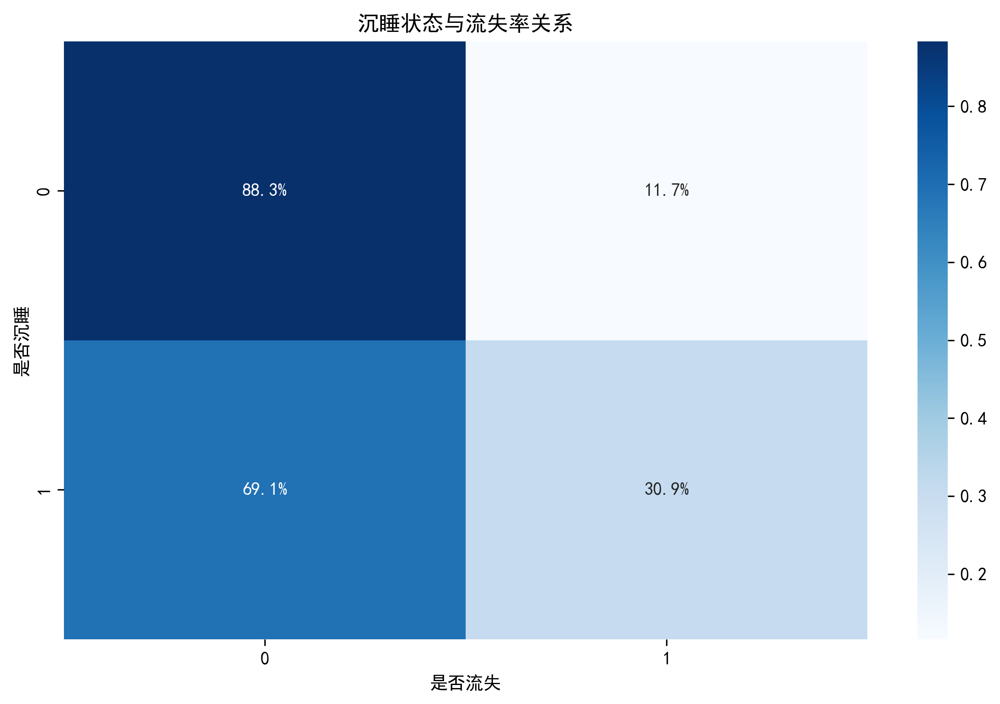
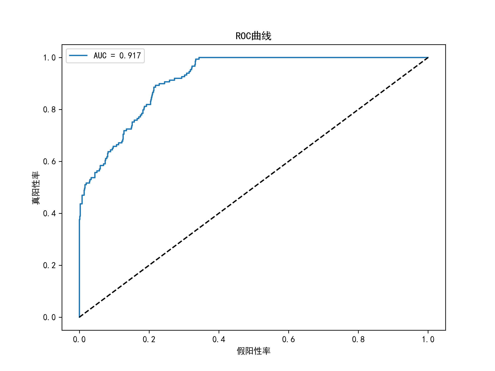
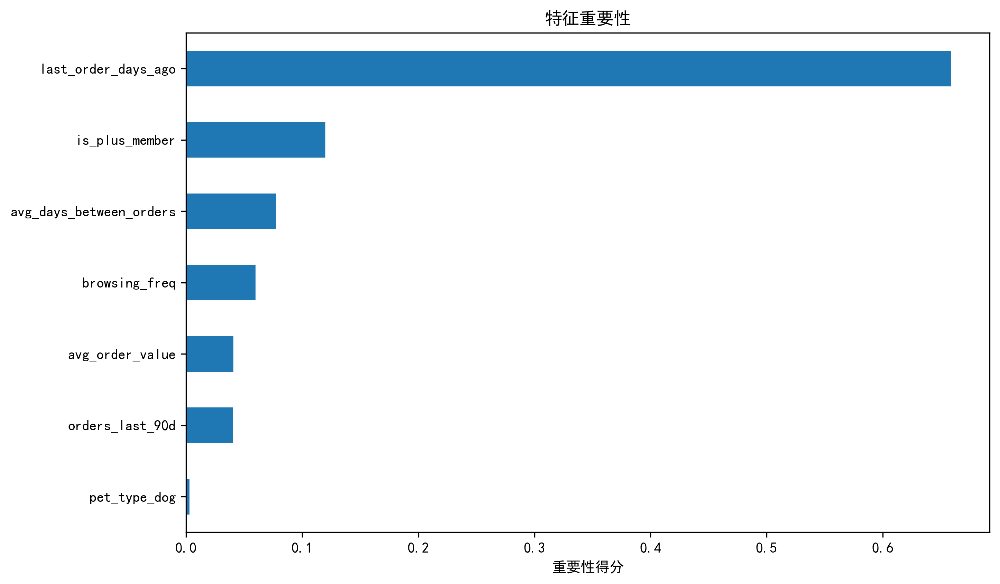

# Zooplus Customer Churn Analysis and Prediction Report

---

### 1. Code Interpretation and Business Logic

#### 1.1 Simulated Data Generation (`generate_simulated_data`)

- **Goal**: Create a dataset aligned with Zooplus business characteristics

- **Key Fields**:
  - `user_id`: Unique user ID  
  - `signup_date`: Signup date (random within 2023)  
  - `is_plus_member`: Paid membership status (40% are members)  
  - `pet_type`: Pet type (60% dog, 40% cat)  
  - `avg_order_value`: Avg order value (€35 for members, €25 for free users)  
  - `orders_last_90d`: Orders in the last 90 days (Poisson: λ=3.5 for members, λ=1.8 for free)  
  - `last_order_days_ago`: Days since last order (random 10–100 days)  
  - `avg_days_between_orders`: Avg interval between orders (25 days for members, 45 for free users)  
  - `browsing_freq`: Browsing frequency (avg 2.5/week for members, 0.8 for free users)  
  - `renewal_date`: Renewal date (signup + 365 days)  
  - `churn`: Whether the user churned (based on business rules)

- **Churn Rules**:
  - **Paid members**: If `last order > 60 days ago` **AND** `orders in 90 days < 2`, churn probability = 70%; otherwise = 20%
  - **Free users**: If `last order > 90 days ago`, then churn
  - **Business Meaning**: Simulates churn caused by user inactivity, especially the silent phase before paid membership renewal

---

#### 1.2 Dormant User Analysis (`analyze_dormant_users`)

- **Dormant Definition**: Paid users with `last order > 60 days ago`

- **Analysis Steps**:
  1. Calculate dormant user ratio (output: 16.9%)
  2. Descriptive statistics (orders, browsing, etc.)
  3. Generate 5 key charts:

##### 📈 Order Volume Distribution — `dormant_order_distribution.png`

- Histogram + KDE
- Red line marks intervention threshold (1.5 orders)

---

##### 📦 Order Value Comparison Boxplot — `dormant_spend_boxplot.png`

- Compares order value between dormant and active users

---

##### 🔍 Behavioral Scatter Plot — `dormant_behavior_scatter.png`

- Axes: `days since last order` vs `browsing frequency`
- Encodes pet type and order value

---

##### 🐾 Pet Type vs Dormant Rate — `dormant_pet_type_stacked.png`

- Stacked chart showing dormancy across pet types

---

##### 🧊 Dormancy vs Churn Heatmap — `dormant_churn_heatmap.png`

- Shows strong positive correlation between dormancy and churn

---

#### 1.3 Churn Prediction Model (`build_churn_model`)

- **Feature Engineering**:
  - Remove irrelevant fields (IDs, dates)
  - One-hot encode `pet_type` (e.g., `pet_type_cat`)
- **Model**: Random Forest Classifier (pipeline includes scaling and classification)
- **Optimization**: Grid Search (`n_estimators`, `max_depth`, `min_samples_split`)
- **Evaluation Metrics**:
  - AUC (0.9174)
  - Classification Report (Precision / Recall / F1)
  - ROC Curve

##### 📈 ROC Curve — `roc_curve.png`

- Model performance (closer to top-left = better)
- Dashed line = baseline
- AUC = 0.917 → Excellent discrimination ability

---

##### 📊 Feature Importance — `feature_importance.png`

- Top: `last_order_days_ago` > `orders_last_90d` > `browsing_freq`
- Interpretation: Days since last order = strongest predictor

---

### 2. Key Metric Interpretation

#### 2.1 Dormant User Metrics

- **Dormant Ratio 16.9%**: 17% of paying users have no order in 60+ days and should be prioritized
- **Order Distribution**: Avg 3.4 orders in 90 days; 25% of users ≤2 orders → focus group
- **Order Value Comparison**: Dormant users have slightly lower average value
- **Pet Type Insight**: Dog owners have slightly higher dormancy (likely due to more frequent dog food purchase cycles)
- **Dormancy vs Churn**: Heatmap shows 80.9% churn among dormant users — a strong signal

---

#### 2.2 Model Evaluation Metrics

- **AUC = 0.9174**: High discrimination between churned and retained users
- **Feature Importance**:
  1. `last_order_days_ago`
  2. `orders_last_90d`
  3. `browsing_freq`
  4. `avg_days_between_orders`

- **Classification Report Focus on Churn (class=1)**:
  - Precision: Of predicted churns, how many actually churned
  - Recall: Of actual churns, how many were correctly predicted
  - F1-score: Harmonic mean of precision and recall

---

### 3. Visualization Analysis

1. **Order Volume Distribution** (`dormant_order_distribution.png`)  
   - **Insight**: Right-skewed distribution; ~30% of users have ≤2 orders → ideal intervention group.

2. **Order Value Boxplot** (`dormant_spend_boxplot.png`)  
   - **Insight**: Dormant users have lower median value, but some high-value dormant users exist.

3. **Behavioral Scatter** (`dormant_behavior_scatter.png`)  
   - **Insights**:
     - Larger points = higher value, color = pet type
     - Top-right users (long inactive but high browsing) = price-sensitive users
     - Bottom-left users (recently inactive, low browse) = urgent recall group

4. **Pet Type vs Dormancy** (`dormant_pet_type_stacked.png`)  
   - **Insight**: Dog owner dormancy = 18.5%, cat = 14.2%

5. **Dormancy vs Churn** (`dormant_churn_heatmap.png`)  
   - **Insight**: Dormant users' churn rate = 80.9% vs 9.7% for non-dormant

6. **ROC Curve** (`roc_curve.png`)  
   - **Insight**: Curve close to top-left, AUC=0.917

7. **Feature Importance** (`feature_importance.png`)  
   - **Insight**: Top features validate business assumptions

---

### 4. Analysis Report

#### 1. Background & Goal

- Analyze dormant risk of paid pet product subscribers
- Predict churn and improve renewal rate

---

#### 2. Core Findings

- Dormant rate = 16.9%; churn rate among dormant = 80.9%
- Key warning signals: `last order > 60d` + `orders in 90d < 2`
- High-value users = High order value + High browsing frequency + Dog owners

---

#### 3. Action Suggestions

**Layered Intervention Strategy**:

| User Type               | Intervention                            | Expected Outcome                |
|------------------------|------------------------------------------|----------------------------------|
| High-value dormant user| Send pet care guide + VIP support        | Retain €120+ LTV users           |
| Low-frequency user     | Push discounted subscription bundles     | +1.5 orders/quarter              |
| High-browse low-convert| Show flash sale popup in app             | +15% conversion rate             |

**Product Optimization**:
- Launch exclusive bundles for dog owners (food + toys + treats)

---

#### 4. Model Deployment Plan

- Deploy churn warning system: if `churn probability > 70%`, auto-trigger interventions
- Monitor KPI:  
  **Intervention ROI = (Retained LTV - Intervention Cost) / Total Cost**
